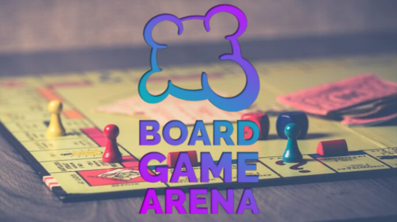
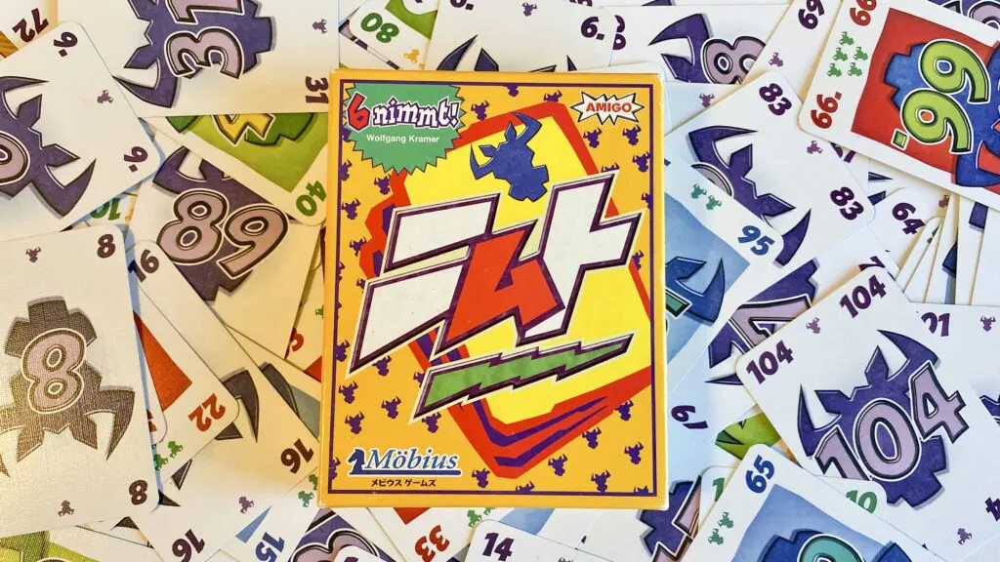
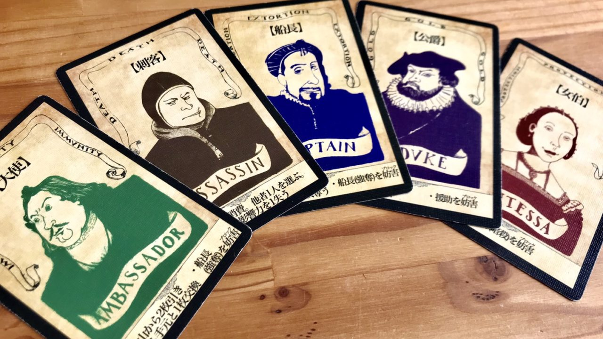
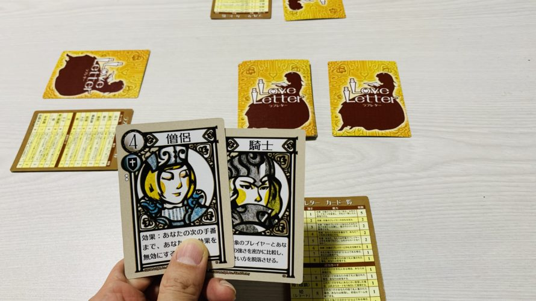

# FS 3月度レクリエーション案内

## オンラインボードゲーム大会

### ⬛ 事前準備のお願い

今回のオンラインボードゲーム大会では、[ボードゲームアリーナ](https://ja.boardgamearena.com/) を利用します。

ボードゲームアリーナを利用するには、サイトでのアカウント作成が必要です。

以下のページにアカウント作成方法を記載しましたので、事前にアカウント作成をお願いします。

ボードゲームアリーナでのアカウント作成手順：  
[https://github.com/fs5013-furi-sutao/fs-rec-2021-03-how-to-get-starting-online-boad-game/edit/main/README.md](./how-to-get-starting-online-boad-game.md)

# ⬛ 🕢 タイムテーブル

## はじめ

<table>
    <tr>
        <th>時刻</th>
        <th>所要時間</th>
        <th>内容</th>
        <th>備考</th>
    </tr>
    <tr>
        <td>13:50 ～</td>
        <td>―</td>
        <td>開場</td>
        <td>こちらから入場ください  FSオンラインボードゲーム大会・REMO： https://live.remo.co/e/fs-4</td>
    </tr>
    <tr>
        <td>14:00 ～</td>
        <td>5分</td>
        <td>あいさつ</td>
        <td>―</td>
    </tr>
    <tr>
        <td>14:05 ～</td>
        <td>5分</td>
        <td>流れの説明(グループの発表)</td>
        <td>―</td>
    </tr>
</table>

 
    
## 🕢 ゲーム① ニムト（6 nimmt!）
 
 <table>
    <tr>
        <td>14:10 ～</td>
        <td>10分</td>
        <td>ゲーム①（ニムト）のやり方説明</td>
        <td>奥原が説明します</td>
    </tr>
    <tr>
        <td>14:20 ～</td>
        <td>10分</td>
        <td>ゲーム①（ニムト）のやり方 Q&amp;A</td>
        <td>奥原が答えます</td>
    </tr>
    <tr>
        <td>14:30 ～</td>
        <td>20分</td>
        <td>各グループでニムトにトライ！</td>
        <td>手慣らしです。時間になったらバッサリ終了します</td>
    </tr>
</table>

 
    
## 🕢 ゲーム② クー（Coup）
 
 <table>
    <tr>
        <td>14:50 ～</td>
        <td>10分</td>
        <td>ゲーム②（クー）のやり方説明</td>
        <td>奥原が説明します</td>
    </tr>
    <tr>
        <td>15:00 ～</td>
        <td>10分</td>
        <td>ゲーム②（クー）のやり方 Q&amp;A</td>
        <td>奥原が答えます</td>
    </tr>
    <tr>
        <td>15:10 ～</td>
        <td>20分</td>
        <td>各グループでクーにトライ！</td>
        <td>手慣らしです。時間になったらバッサリ終了します</td>
    </tr>
</table>

 
    
## 🕢 ゲーム③ ラブレター（Love Letter）
 
 <table>
    <tr>
        <td>15:30 ～</td>
        <td>10分</td>
        <td>ゲーム③（ラブレター）のやり方説明</td>
        <td>奥原が説明します</td>
    </tr>
    <tr>
        <td>15:40 ～</td>
        <td>10分</td>
        <td>ゲーム③（ラブレター）のやり方 Q&amp;A</td>
        <td>奥原が答えます</td>
    </tr>
    <tr>
        <td>15:50 ～</td>
        <td>20分</td>
        <td>各グループでラブレターにトライ！</td>
        <td>手慣らしです。時間になったらバッサリ終了します</td>
    </tr>
</table>

 
    
## 🕢 テーブルチェンジ
 
 <table>
    <tr>
        <td>16:10 ～</td>
        <td>5分</td>
        <td>イス取りゲーム</td>
        <td>やりたいゲームのテーブルに着席（早いもの順）</td>
    </tr>
    <tr>
        <td>16:15 ～</td>
        <td>40分</td>
        <td>各テーブルで本気プレイ！</td>
        <td>全力でプレイしましょう</td>
    </tr>
    <tr>
        <td>16:55 ～</td>
        <td>5分</td>
        <td>おわりに</td>
        <td>みなさん、お疲れ様でした</td>
    </tr>
</table>

### 17:00 ～ 希望者が集まれば AmongUs をやります 

> 参加されたい方は 17:00 になったら、  
> DISCORD > RELAXATION >  📢休憩室 にお越しください  
> https://discord.gg/8NX59XN

# ⬛ 👩‍👩‍👧‍👦 今回のグループ分け

<table>
    <tr>
        <th>1回目のテーブル</th>
        <th>A テーブル</th>
        <th>B テーブル</th>
        <th>C テーブル</th>
        <th>D テーブル</th>
        <th>E テーブル</th>
    </tr>
    <tr>
        <td>1</td>
        <td>中野義嗣</td>
        <td>奥原</td>
        <td>橋本</td>
        <td>近藤</td>
        <td>今立唯子</td>
    </tr>
    <tr>
        <td>2</td>
        <td>五斗圭</td>
        <td>太田康介</td>
        <td>太田真康</td>
        <td>渋谷誠之</td>
        <td>林 江里香</td>
    </tr>
    <tr>
        <td>3</td>
        <td>福島剛</td>
        <td>坂口智昭</td>
        <td>各務拓</td>
        <td>宮田涼</td>
        <td>稲垣来未</td>
    </tr>
    <tr>
        <td>4</td>
        <td>内田祐太</td>
        <td>荒川 貴詳</td>
        <td>山本晃大</td>
        <td>金山哲也</td>
        <td>青木結汰</td>
    </tr>
    <tr>
        <td>5</td>
        <td>青木宏行</td>
        <td>大林達矢</td>
        <td>森澤直之</td>
        <td>斉藤憲吾</td>
        <td>田中聖人</td>
    </tr>
    <tr>
        <td>6</td>
        <td>倉田卓弥</td>
        <td>中島駿介</td>
        <td>中川堅太</td>
        <td>水野愛美</td>
        <td>長浦真帆</td>
    </tr>
    <tr>
        <td>7</td>
        <td>―</td>
        <td>―</td>
        <td>―</td>
        <td>―</td>
        <td>松浦晴菜</td>
    </tr>
</table>

<table>
    <tr>
        <th rowspan="2">2回目のテーブル</th>
        <th>ニムト [ １ ]</th>
        <th>ニムト [ ２ ]</th>
        <th>クー [ １ ]</th>
        <th>クー [ ２ ]</th>
        <th>ラブレター [ １ ]</th>
        <th>ラブレター [ ２ ]</th>
    </tr>
    <tr>
        <td colspan="6">イス取りゲーム形式でテーブルチェンジします！</td>
    </tr>
</table>

 

# 🧩🎲 今回トライするゲーム① ニムト（6 nimmt!）

> ## ゲーム説明動画
> 
>   
> ニムト（6 nimmt!）1分半でわかるルール動画：  
> https://youtu.be/KuxTF5JQKJc

> ## ルール説明書
> 
> ニムト 遊び方説明書：  
> [http://www.mobius-games.co.jp/PDF/nimmt.pdf](http://www.mobius-games.co.jp/PDF/nimmt.pdf)

 

# 🧩🎲 今回トライするゲーム② クー（Coup）

> ## ゲーム説明動画
> 
> 
> クー（coup）　ルール説明＆プレイ動画：  
> https://youtu.be/4To6XNGuXWA

> ## ルール説明書
> 
> クー（Coup） 遊び方説明書：  
> [https://w.atwiki.jp/bga9997/pages/136.html](https://w.atwiki.jp/bga9997/pages/136.html)

 

# 🧩🎲 今回トライするゲーム③ ラブレター（Love Letter）

> ## ゲーム説明動画
> 
>   
> 初めての方にオススメのボードゲーム「ラブレター」遊び方解説：  
> https://youtu.be/_e4-8Q-Vzsc

> ## ルール説明書
> 
> ラブレター（Love Letter） 遊び方説明書：  
> [http://www.arclight.co.jp/ag/ll/rule/LoveLetter_WebRule.pdf](http://www.arclight.co.jp/ag/ll/rule/LoveLetter_WebRule.pdf)

 
